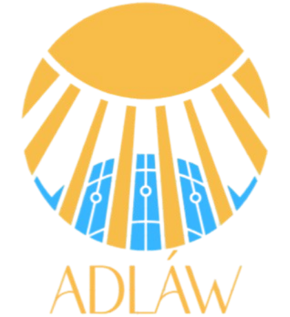

# Adlaw Mobile Application
<p align="center">
  
</p>

This is a mobile application for our design project called "Design of Defective Module Detection for Solar  Panel Thermography Analysis System using Deep Learning". 

The general objective of the project is to design a defective module detection for  solar panel thermography analysis that fulfills the client's requirements while adhering to engineering standards and considering various constraints including economic, sustainability, environmental, safety, risk, public health, welfare, social, global, and cultural factors along with computation of trade-offs from multiple realistic constraints.

Specifically, it aims to:
1. Design a prototype that captures thermal images namely single cell, open-circuited PV module, short-circuited PV module, and bypass diode failure.
2. Develop a mobile application that:
- Accepts user input from the system prototype, specifically thermal images of monocrystalline silicon solar panels.
- Alerts users about detected defects and their severity levels.
- Displays detailed information about the detected defects including: stress factors, power loss, category, classes of abnormalities and description based on IEC 62446-1, 2 and 3.
- Recommends corrective actions based on defect history.
3. Test and evaluate the accuracy of the prototype.

The application is built with a robust technology stack to ensure efficiency, scalability, and seamless user experience. The backend is powered by FastAPI, a high-performance web framework, and Ultralytics YOLOv8, a state-of-the-art deep learning model for defect detection. The defect detection model is self-hosted using a reverse proxy (ngrok), allowing secure and reliable communication between the mobile application and the backend server. Ngrok is a globally distributed reverse proxy that enables secure ingress to applications running in various environments, including local development, cloud platforms, and IoT devices. It simplifies network configurations by providing a unified ingress platform that integrates reverse proxy, API gateway, firewall, and load balancing features. This allows the Adlaw system to be accessed securely and efficiently from anywhere without complex network setups. Appwrite serves as the backend service, handling authentication, database management, and other essential cloud functions. On the frontend, the mobile application is developed using React Native, providing a cross-platform solution for both Android and iOS users. The development, production, and deployment processes are streamlined with Expo Go SDK 51, enabling rapid iteration, debugging, and seamless integration with native device functionalities


To install the dependencies for FastAPI, run the following command:
```
# Create and activate virtual environment
python -m venv venv
source venv/bin/activate  # On Windows: venv\Scripts\activate

# Install requirements
pip install -r requirements.txt

# For development only
pip install -r requirements.txt[dev]
```
To install the dependencies for React Native, run the following command:
```
npm install
```
For updating old dependencies, run the command:
```
npx expo install --check
```
To start the Expo development server, run:
```
npx expo start
```
To start the FastAPI server, run:
```
cd deeplearning
uvicorn main:app --reload --host 0.0.0.0 --port 8000
```
To start ngrok, run:
```
choco install ngrok
ngrok config add-authtoken <TOKEN>
ngrok http 8000 --host-header="localhost:8000"
```
